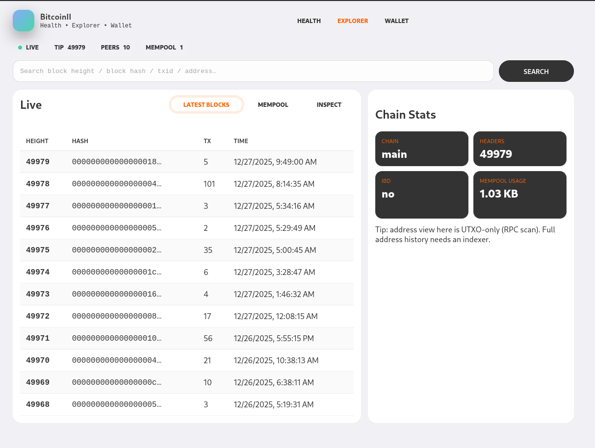
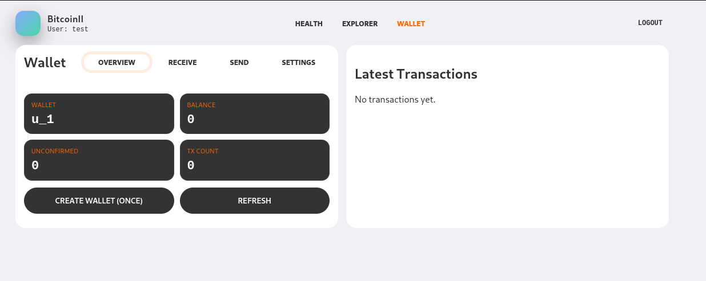

# docs

## BitcoinII Dashboard

**Self-Hosted Node Dashboard, Explorer & Wallet**

BitcoinII Dashboard is a **lightweight, self-hosted web interface** for running and monitoring a **BitcoinII full node**.\
It is designed to run **alongside your node**, prioritizing **security, simplicity, and local control**.

This project provides:

* 🩺 Node health & sync monitoring
* 🔍 Lightweight blockchain explorer
* 👛 Optional local wallet UI (advanced users only)
* 🐳 Docker-first deployment
* 🔐 Cookie-based RPC authentication

> **Design Philosophy**\
> The dashboard must never reduce the security posture of the node it observes.

***

### Why This Project Exists

Running a full node should not require:

* Exposing RPC ports publicly
* Heavy indexers for basic inspection
* Cloud dashboards with unclear security

BitcoinII Dashboard was built to provide **clear visibility**, **minimal overhead**, and **strong defaults**, while remaining fully self-hosted.

***

### Features Overview

| Feature      | Description                             |
| ------------ | --------------------------------------- |
| Health Check | Node sync, peers, mempool, chain state  |
| Explorer     | Latest blocks, mempool, tx/block lookup |
| Wallet UI    | Local hot wallet (advanced use only)    |
| Security     | Cookie-based RPC auth, no exposed RPC   |
| Platform     | x86, ARM, NAS, Raspberry Pi             |
| Deployment   | Docker / Docker Compose                 |

***

## Getting Started

### Requirements

* Docker ≥ 20
* Docker Compose v2
* A running BitcoinII full node

**Recommended image:**

* `kzwo/bitcoin-ii`

***

### Quick Start (Docker Compose)

#### 1. Create a project directory

```bash
mkdir bitcoinii-stack
cd bitcoinii-stack
```

***

#### 2. Create `docker-compose.yml`

```yaml
services:
  bitcoinii:
    image: kzwo/bitcoin-ii:latest
    restart: unless-stopped
    volumes:
      - bc2-data:/data
    ports:
      - "8338:8338"
      - "127.0.0.1:8339:8339"
    command:
      - "-server=1"
      - "-rpcport=8337"
      - "-rpcbind=0.0.0.0"
      - "-rpcallowip=172.30.0.0/24"

  dashboard:
    image: kzwo/bitcoin-ii-dashboard:latest
    depends_on:
      bitcoinii:
        condition: service_healthy
    volumes:
      - bc2-data:/data:ro
    environment:
      RPC_HOST: bitcoinii
      RPC_PORT: "8337"
      RPC_COOKIE: "/data/.cookie"
    ports:
      - "127.0.0.1:3000:3000"

volumes:
  bc2-data:
```

***

#### 3. Start services

```bash
docker compose up -d
```

***

### Accessing the UI

| Feature          | URL          |
| ---------------- | ------------ |
| Health Dashboard | `/health-ui` |
| Explorer         | `/explorer`  |
| Wallet           | `/wallet`    |

> Root `/` redirects to Explorer.

***

## Health Check


Provides real-time visibility into node state and synchronization progress.

***

## Lightweight Explorer



Inspect blockchain data via RPC without running an indexer.

***

## Wallet (Advanced Feature)


The wallet UI is designed **only for trusted environments** (NAS, home servers).

***

### Creating a Wallet



Create a wallet once from the Overview page.

***

### Receiving Funds


Generate fresh receiving addresses safely.

***

### Sending Funds


Spending is locked by default for safety.

***

### TOTP / Two-Factor Authentication


Protect wallet actions using TOTP / 2FA.

***

## Security Architecture

* Cookie-based RPC authentication
* No exposed RPC credentials
* Network-isolated Docker services

***

## Development

```bash
git clone https://github.com/kleokzwo/health_check
cd health_check/dashboard
docker compose up -d
docker compose logs -f dashboard

or:

docker compose build dashboard
docker compose up -d dashboard
docker compose logs -f dashboard

```

***

## Contributing

Contributions are welcome. Please open issues or pull requests.

***

## Disclaimer

This is an **unofficial community project**.\
Use at your own risk.

***

## License

MIT
